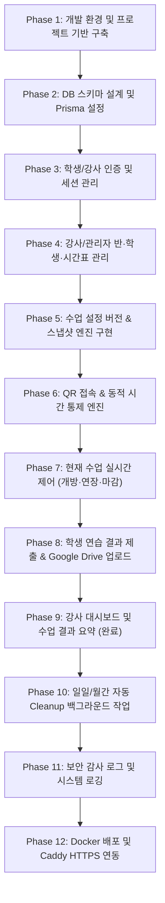

# 미용학원 연습 기록 사이트 개발 페이즈(Phase) 실행 계획

본 문서는 `Plan.md`에 정의된 요구사항, 핵심 운영 정책, 데이터베이스 스키마 및 기능 명세를 바탕으로 프로젝트 구축 순서를 구체적인 단계(Phase)별로 정리를 수행한 실행 가이드입니다.

---

## 🏗️ 전체 개발 페이즈 요약

---

## Phase 1: 개발 환경 및 프로젝트 기반 구축

### 🎯 목표
Next.js 16, TypeScript, Tailwind CSS v4 기반의 프로젝트 구조를 정립하고 개발 환경을 준비합니다.

### 📝 주요 작업 내용
1. **프로젝트 구조 정비**
   - 생성된 Next.js 16 (`skb_workbook`) 디렉토리 구조 검토 및 App Router 세팅
   - 기본 패키지(`@prisma/client`, `@prisma/adapter-pg`, `pg`, `googleapis`, `argon2`, `zod`) 의존성 호환성 점검
2. **글로벌 설정 및 타임존 지정**
   - 대한민국 운영 시간대 (`Asia/Seoul`) 설정 모듈 작성
   - 환경 변수 (`.env.example`, `.env.local`) 템플릿 구성
3. **디자인 시스템 및 레이아웃**
   - Tailwind CSS v4 스타일링 설정
   - 학생용 반응형 웹뷰 레이아웃 및 강사/관리자 대시보드 공통 레이아웃 틀 제작

---

## Phase 2: 데이터베이스 스키마 설계 및 Prisma 7 설정

### 🎯 목표
`Plan.md` 12절의 핵심 모델과 관계를 반영하는 Prisma 데이터베이스 스키마를 정의하고 마이그레이션을 수행합니다.

### 📝 주요 작업 내용
1. **Prisma 7 스키마 정의 (`schema.prisma`)**
   - `Teacher`: 강사/관리자 계정 (이메일/아이디, 비밀번호 해시, 권한 구별)
   - `Class`: 반 기본 정보 및 현재 활성 설정 버전 포인터
   - `ClassSettingVersion`: 반 설정 버전 관리 스키마 (다음 수업 적용용)
   - `Student`: 학생 이름, PIN 해시, 상태 (동명이인 조회를 위한 식별값 포함)
   - `Enrollment`: 학생-반 연결 정보 및 적용 시점
   - `PracticeCategory`: 반별 연습 종목
   - `ClassSchedule`: 정규 시간표 (요일, 시작/종료 시각, 사전접속/유예시간)
   - `ScheduleException`: 휴강, 보강, 임시 수업
   - `ClassSession`: 실시간 수업 회차 및 시작 당시 설정 스냅샷 (JSON/필드)
   - `StudentSession`: 현재 수업 회차 전용 학생 인증 토큰/세션
   - `Submission`: 텍스트 연습 결과 (연습 종목, 연습 시간, 결과 설명, 제출 시각)
   - `SubmissionFile`: Google Drive 파일 ID, 파일명, 용량, 삭제 여부 (`isDeleted`)
   - `SettingChangeLog`: 반 설정 변경 변경자/시각/이력
   - `AccessControlLog`: 강사 수동 개방/연장/마감 감사 로그
   - `CleanupLog`: 자동 일일/월간 삭제 성공·실패 로그
2. **PostgreSQL 연동 및 Migration**
   - `@prisma/adapter-pg` 드라이버 어댑터 설정
   - Database Migration 실행 (`prisma db push` 또는 `prisma migrate dev`)

---

## Phase 3: 인증 및 세션 관리 (강사 & 학생)

### 🎯 목표
강사/관리자 로그인 기능과 학생의 `이름 + PIN` 인증 및 수업 전용 보안 세션 구조를 구현합니다.

### 📝 주요 작업 내용
1. **강사/관리자 인증**
   - 강사 로그인 API 및 세션/쿠키 기반 인증 (Role: 관리자, 일반 강사)
   - 비밀번호 해싱 (`argon2`)
2. **학생 이름 + PIN 인증 시스템**
   - PIN 보안 해시 처리 (`argon2` 이용) 및 PIN 재설정 기능
   - 반별 고정 QR 접속 시 학생 이름 + PIN 검증 API
   - 동명이인이 존재할 경우 동일 반 내 PIN 및 학생 ID로 정확히 개별 식별
3. **`ClassSession` 전용 학생 세션 발급**
   - 검증 성공 시 **현재 수업 회차(`ClassSession`) 전용 단기 학생 세션** 생성 및 토큰 발급
   - 수업 마감 시 기존 발급 세션 즉시 무효화

---

## Phase 4: 강사/관리자 반·학생·시간표 관리

### 🎯 목표
강사 및 관리자가 담당 반, 학생 명단, 정규 시간표 및 연습 종목을 관리하는 기본 CRUD 기능을 구축합니다.

### 📝 주요 작업 내용
1. **반 및 연습 종목 관리**
   - 반 생성, 활성화/비활성화, 담당 강사 지정
   - 반별 기본 연습 종목(커트, 펌, 컬러 등) 등록 및 수정
2. **학생 명단 및 반 등록(Enrollment) 관리**
   - 학생 등록, 명단 조회, PIN 초기화
   - 학생 반 제외 및 반 이동 기능
3. **정규 시간표 및 휴강/보강 설정**
   - 요일별 정규 수업 시간표(시작/종료 시각) 설정
   - 사전 접속 허용시간(예: 10분 전) 및 제출 유예시간(예: 10분 후) 기본값 관리
   - 특정 날짜 휴강 및 보강/임시 수업 등록 (`ScheduleException`)

---

## Phase 5: 수업 설정 버전 & 스냅샷 엔진 구현

### 🎯 목표
**"모든 반 일반 설정 변경은 다음 수업부터 적용되며, 진행 중인 수업은 시작 시점의 스냅샷을 끝까지 유지한다"**는 핵심 원칙을 엔진 레벨에서 구현합니다.

### 📝 주요 작업 내용
1. **설정 버전 관리 (`ClassSettingVersion`)**
   - 강사가 반 설정을 저장할 때 현재 진행 중인 수업에 즉시 반영하지 않고 새 `ClassSettingVersion`을 생성 및 기록
   - 설정 변경 이력 로그 (`SettingChangeLog`) 자동 기록
2. **수업 회차 스냅샷 (`ClassSession`) 복사 생성**
   - 정규 시간표 또는 사전 접속 시간에 의해 새로운 `ClassSession`이 생성될 때, 해당 시점의 `ClassSettingVersion`을 복사하여 스냅샷 저장
   - 복사 항목: 수업 시각, 접속 허용 구간, 연습 종목 목록, 등록 학생 명단 기준, 파일 제한 규정
3. **진행 중인 수업과 설정의 완전 분리 검증**
   - 설정 페이지 수정 시 "다음 수업부터 적용됩니다" 안내 UI 적용
   - 수정 후에도 기존 생성되어 진행 중인 `ClassSession` 스냅샷이 변경되지 않음을 보장하는 도메인 로직 완성

---

## Phase 6: QR 접속 & 동적 접속 통제 엔진

### 🎯 목표
반별 고정 QR 코드로 접근 시, 현재 시각과 수업 스냅샷을 비교하여 실시간 접속 및 제출 권한을 통제합니다.

### 📝 주요 작업 내용
1. **반별 고정 QR 링크 게이트웨이**
   - `https://domain.com/join/[class-token]` 형태의 QR URL 생성 및 인쇄/다운로드 기능
2. **동적 접속 허용 구간 판정 엔진**
   - 시작 시간 - 사전 접속 허용시간 ~ 종료 시간 + 제출 유예시간 사이의 실제 허용 구간 계산
3. **다단계 실시간 접근 통제 (Access Control Middleware/Guard)**
   - 다음 시점마다 서빙 전 접근 권한 재검증:
     1. QR 페이지 접속 시
     2. 이름·PIN 인증 시
     3. 파일 업로드 시작 시
     4. 제출 저장 요청 시
     5. 히스토리 조회 시
     6. 기존 세션으로 재접속 시
   - 수업 시간이 아니거나 마감 후 요청 시 차단 화면 및 에러 응답 전달

---

## Phase 7: 현재 수업 실시간 제어 (개방·연장·마감)

### 🎯 목표
반 기본 설정을 건드리지 않고, 강사가 진행 중인 **현재 수업 회차(`ClassSession`)만 실시간으로 운영 조작**할 수 있는 제어 기능을 구현합니다.

### 📝 주요 작업 내용
1. **실시간 수업 운영 조작 API**
   - **지금 열기**: 정규 시간 전 수업 세션 강제 개방
   - **시간 연장**: 현재 수업 종료/유예 시간을 10분, 30분, 60분 연장
   - **즉시 마감**: 수업 세션을 강제 마감하고 모든 학생 세션 상 무효화
2. **운영 조작 감사 로그 (`AccessControlLog`)**
   - 제어 실행 시 조작한 강사 ID, 제어 종류, 제어 시각, 변경된 허용 시각 기록
3. **UI 분리**
   - 강사 대시보드 내 "반 설정(다음 수업 적용)" 메뉴와 "오늘의 수업 제어(현재 수업 적용)" 메뉴를 명확히 화면상으로 분리

---

## Phase 8: 학생 연습 결과 제출 & Google Drive 스트리밍 업로드

### 🎯 목표
학생이 수업 시간에 연습 결과 텍스트와 사진/영상 첨부파일을 Google Drive로 안전하게 업로드하고 제출할 수 있도록 합니다.

### 📝 주요 작업 내용
1. **학생 제출 Form UI**
   - 연습 종목 선택, 연습 시간 입력, 결과 설명 텍스트 작성
   - 사진 및 동영상 첨부 파일 선택 UI
2. **Google Drive API 스트리밍 업로드 서비스**
   - 서버 디스크에 파일을 장기 저장하지 않고, Google Drive API로 직접 스트리밍 전송
   - 업로드 완료 후 Google Drive 파일 ID, 파일명, 크기를 `SubmissionFile` 테이블에 기록
3. **학생 히스토리 조회**
   - 제출 후 현재 수업 시간에 자신이 제출한 텍스트 및 첨부 상태 확인 (타 학생 접근 불가)
   - 수업 마감 후 추가 제출 및 수정 차단

---

## Phase 9: 강사 대시보드 및 수업 결과 요약

### 🎯 목표
강사가 수업별, 학생별 연습 제출 결과를 한눈에 확인하고 관리할 수 있는 요약 페이지를 구현합니다.

### 📝 주요 작업 내용
1. **강사 대시보드 (오늘의 수업 현황)**
   - 현재 진행 중인 수업 접속 학생 수, 제출 학생 수, 미제출 학생 수 실시간 현황
2. **수업 회차별 결과 요약 페이지**
   - 날짜, 반, 수업 회차별 조회 기능
   - 총 등록 인원, 제출 인원, 총 연습 횟수, 총 연습 시간 요약 카드
   - 학생별 제출 횟수, 연습 종목, 마지막 제출 시각 목록 표기
3. **학생별 상세 제출 기록 확인**
   - 학생 클릭 시 텍스트 연습 결과, 제출 시각, 연습 종목, 작성 설명 표시
   - **보안/정책 반영**: 이미 자동 삭제된 파일의 다운로드 링크나 미리보기는 표시하지 않고 삭제 상태 표기

---

## Phase 10: 일일/월간 자동 Cleanup 백그라운드 작업

### 🎯 목표
데이터 보관 정책에 따라 Google Drive 파일 완전 삭제 및 월간 연습 결과 정리 작업을 자동화합니다.

### 📝 주요 작업 내용
1. **일일 백그라운드 Cleanup 작업 (매일 오전 4시)**
   - [x] Next.js 서버 내부 4:00 AM KST 백그라운드 타이머 스케줄러 (`src/lib/cronScheduler.ts`)
   - [x] 제출 다음 날 구글 드라이브 사진/영상 일괄 삭제 및 DB 롤백 엔진 (`src/lib/cleanupEngine.ts`)
   - [x] Cleanup 크론 API (`POST /api/cron/cleanup`) 및 강사 대시보드 수동 실행 버튼 연동
   - 삭제 성공 시 `SubmissionFile` 데이터 삭제 및 `isDeleted` 처리 (텍스트 연습 결과는 유지)
   - 실패 시 재시도 로직 및 `CleanupLog`에 성공/실패 기록
2. **월간 백그라운드 Cleanup 작업 (매월 1일 새벽 3시)**
   - **전전월 이전 데이터 삭제 정책**: 전전월까지의 텍스트 연습 결과 및 요약 삭제 (직전 달 기록은 보관하여 월말 수업 데이터 유실 방지)
3. **독립 스케줄러 서비스 구성**
   - Docker 내 전용 `cleanup` 작업용 모듈 또는 Cron 작업 스케줄링 구축

--- [x] **Phase 11: 보안 감사 로그 & 시스템 로깅** ✅ 완료
  - [x] 통합 보안 감사 기록 헬퍼 엔드포인트 (`src/lib/auditLogger.ts`)
  - [x] 감사 로그 조회 API (`GET /api/teacher/audit-logs`)
  - [x] 시스템 보안 감사 로그 타임라인 포털 UI (`/teacher/dashboard/audit-logs`)

### 📝 주요 작업 내용
1. **로그 테이블 통합 관리 UI (관리자 전용)**
   - `SettingChangeLog`: 누가 어떤 설정을 언제 변경했는지 이력 확인
   - `AccessControlLog`: 강사의 수업 연장/강제 마감 기록
   - `CleanupLog`: 파일/데이터 자동 삭제 성공 및 실패 재시도 기록
2. **관리자 예외 처리 (학생 즉시 차단)**
   - 보안 이슈 발생 시 특정 학생 즉시 접속 차단 및 감사 로그 강제 기록 기능

---

## Phase 12: Docker 배포 및 Caddy HTTPS 연동

### 🎯 목표
운영 환경에 Docker Compose로 서비스를 패키징하고, 기존 호스트 Caddy와 연동하여 안정적으로 배포합니다.

### 📝 주요 작업 내용
1. **Dockerfile 및 Docker Compose 구성**
   - `app` (Next.js 웹 애플리케이션)
   - `db` (PostgreSQL 17 Container)
   - `cleanup` (일일/월간 데이터 정리 백그라운드 컨테이너)
   - `backup` (DB 영구 데이터 자동 백업 컨테이너)
2. **호스트 Caddy HTTPS 리버스 프록시 연동**
   - Caddyfile에 `reverse_proxy 127.0.0.1:3000` 설정 및 80/443 외부 포트 연결
3. **최종 통합 검증 및 MVP 완료 테스트**
   - QR 접속 ~ 시간 통제 ~ 설정 변경(다음 수업 적용) ~ Google Drive 업로드 ~ 자동 삭제 일련의 동시성 및 통합 검증 진행

---

## 📌 Phase 진행 체크리스트

| 페이즈 | 주요 항목 | 상태 |
| :--- | :--- | :---: |
| **Phase 1** | Next.js 16 + Tailwind CSS v4 개발 환경 구성 | ✅ 완료 |
| **Phase 2** | Prisma 7 PostgreSQL 스키마 및 마이그레이션 | ✅ 완료 |
| **Phase 3** | 학생/강사 인증 & ClassSession 세션 발급 | ✅ 완료 |
| **Phase 4** | 강사/관리자 반·학생·시간표 CRUD | ✅ 완료 |
| **Phase 5** | 반 설정 버전 & 다음 수업 적용 스냅샷 엔진 | ✅ 완료 |
| **Phase 6** | 반별 QR 링크 & 동적 접속 통제 가드 | ✅ 완료 |
| **Phase 7** | 실시간 수업 제어 (지금열기/연장/마감) | ✅ 완료 |
| **Phase 8** | 학생 제출 Form & Google Drive 스트리밍 업로드 | ✅ 완료 |
| **Phase 9** | 강사 대시보드 & 수업 결과 요약 UI | ⬜ 미진행 |
| **Phase 10**| 일일/월간 자동 Cleanup 작업 스케줄러 | ⬜ 미진행 |
| **Phase 11**| 보안 감사 로그 & 관리자 이력 조회 | ⬜ 미진행 |
| **Phase 12**| Docker Compose 컨테이너화 & Caddy 배포 | ⬜ 미진행 |
