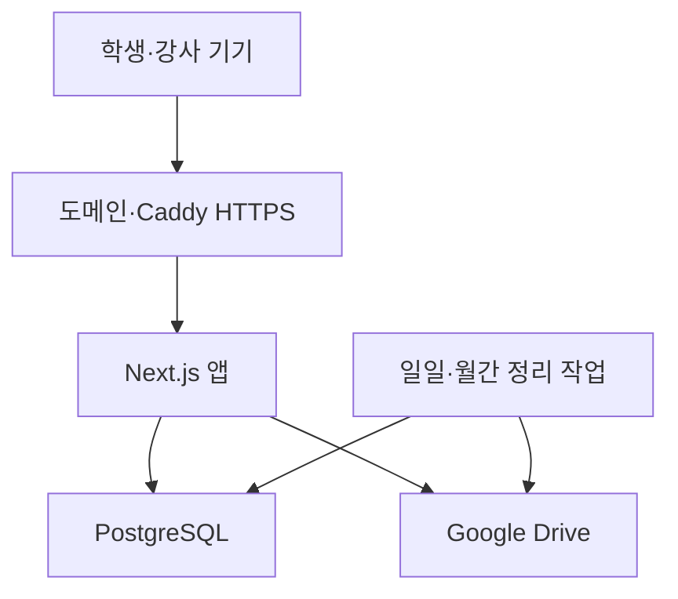
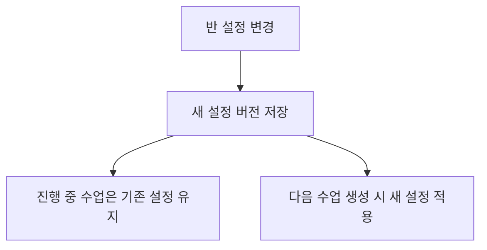

# 미용학원 연습 기록 사이트 개발 플랜 — 최종 수정안

## 1. 서비스 목표

학생이 반별 QR 코드로 접속해 `이름 + 개인 PIN`으로 인증하고, 수업 시간에만 연습 결과와 파일을 제출하는 웹사이트입니다.

강사는 반과 학생, 시간표, 접속 정책을 관리하고 수업별 연습 결과를 요약해서 확인할 수 있습니다.

핵심 운영 정책은 다음과 같습니다.

- 수업 설정 변경은 무조건 **다음 수업부터 적용**
- 진행 중인 수업의 설정은 변경하지 않음
- 진행 중인 수업 화면에서 설정을 변경하더라도 현재 수업에는 반영되지 않음
- 학생 첨부파일은 다음 날 완전 삭제
- 파일을 제외한 연습 결과는 약 한 달간 보관
- Docker Compose로 자체 서버 PC에 배포
- 기존 Caddy와 도메인으로 HTTPS 제공

---

## 2. 기술 구성

| 영역          | 기술                   |
| ------------- | ---------------------- |
| 개발 언어     | TypeScript             |
| 웹 프레임워크 | Next.js                |
| UI            | Tailwind CSS           |
| 데이터베이스  | PostgreSQL             |
| ORM           | Prisma                 |
| 파일 저장     | Google Drive API       |
| 학생 인증     | 이름 + 개인 PIN        |
| 접속 방식     | 반별 고정 QR           |
| 접속 통제     | 시간표 + 수업 회차     |
| 배포          | Docker Compose         |
| HTTPS         | 호스트 Caddy           |
| 자동 작업     | 일일·월간 Cleanup 작업 |
| 운영 시간대   | `korea/seoul`          |

---

## 3. 시스템 구조



외부에는 Caddy의 `80/443` 포트만 공개합니다. Next.js는 `127.0.0.1:3000`에 연결하고 PostgreSQL은 Docker 내부 네트워크에서만 접근하게 합니다.

---

## 4. 사용자 구분

### 학생

- QR 링크 접속
- 이름과 PIN 인증
- 현재 수업의 연습 결과 제출
- 자기 제출 기록 확인
- 다른 학생의 기록 및 파일 접근 불가

### 일반 강사

- 담당 반 관리
- 학생 명단 및 연습 종목 관리
- 다음 수업부터 적용될 설정 변경
- 담당 반의 수업 결과 확인
- 현재 수업 수동 개방·연장·마감

### 관리자

- 모든 반과 강사 관리
- 담당 강사 변경
- 반 보관 처리
- 전체 운영 및 삭제 로그 확인

---

## 5. 학생 이용 과정

1. 교실에 비치된 반별 QR 코드 스캔
2. 서버가 현재 접근 가능한 수업인지 확인
3. 학생 이름과 PIN 입력
4. 해당 반 소속 여부 확인
5. 현재 `ClassSession` 전용 인증 세션 발급
6. 연습 결과 입력
   - 연습 종목
   - 연습시간
   - 결과 설명
   - 사진·영상·첨부파일

7. 제출 완료
8. 현재 수업에서 자신이 제출한 히스토리 확인
9. 수업 마감 후 업로드·제출·히스토리 접근 차단

동명이인은 서로 다른 PIN과 내부 학생 ID로 구분합니다.

---

## 6. QR 및 접속 시간 통제

QR 코드는 반별 고정 주소를 사용하되, 서버가 현재 수업 상태를 판정해 접근을 통제합니다.

```text
https://practice.example.com/join/무작위-반-토큰
```

예시:

| 항목           | 설정 예               |
| -------------- | --------------------- |
| 정규 수업      | 목요일 14:00~16:00    |
| 사전 접속      | 시작 10분 전          |
| 제출 유예      | 종료 후 10분          |
| 실제 허용 시간 | 13:50~16:10           |
| 마감 후        | 인증·업로드·제출 차단 |

서버는 다음 시점마다 접근 권한을 다시 확인합니다.

- QR 페이지 접속
- 이름·PIN 인증
- 파일 업로드 시작
- 제출 저장
- 히스토리 조회
- 기존 세션으로 재접속

학생이 페이지를 미리 열어 놓았더라도 수업이 마감되면 추가 업로드나 제출은 할 수 없습니다.

---

## 7. 수업 설정 적용 원칙

### 확정 원칙

강사가 변경한 반 설정은 **항상 앞으로 열릴 수업부터 적용**합니다.

진행 중인 수업은 수업 시작 시점에 확정된 설정값을 그대로 사용합니다. 강사가 진행 중인 수업이 있는 반의 설정 페이지를 수정하더라도 그 변경은 현재 수업에 반영되지 않습니다.



### 다음 수업부터 적용되는 설정

- 반 이름과 설명
- 정규 수업 요일
- 시작·종료 시각
- 사전 접속 허용시간
- 제출 유예시간
- 기본 연습 종목
- 학생 명단 변경
- 담당 강사 변경
- QR 및 접속 정책
- 파일 개수·크기 제한
- 반 활성화·비활성화

설정을 저장하면 다음처럼 안내합니다.

> 설정이 저장되었습니다.
> 이 변경은 진행 중인 수업이 아닌 다음 수업부터 적용됩니다.

### 현재 수업에만 적용되는 별도 조작

다음 기능은 반 설정 변경이 아니라 **현재 수업 회차에 대한 실시간 운영 명령**으로 분리합니다.

- 지금 열기
- 즉시 마감
- 10분·30분·60분 연장

이 기능은 현재 수업에만 적용하고 다음 수업의 기본 설정은 변경하지 않습니다.

따라서 화면에서도 `반 설정`과 `현재 수업 제어`를 분리해야 합니다.

---

## 8. 설정 버전 및 수업 스냅샷

각 수업 회차는 생성될 때 당시 반 설정을 복사하여 보관합니다.

예를 들어 `ClassSession`에는 다음 값을 스냅샷으로 저장합니다.

- 수업 시작·종료 시각
- 사전 접속시간
- 제출 유예시간
- 적용된 시간대
- 담당 강사
- 적용 설정 버전
- 수업 당시 연습 종목
- 수업 당시 학생 명단 기준

반 설정을 나중에 바꿔도 이미 열린 수업의 스냅샷은 수정되지 않습니다.

권장 데이터 구조:

```text
Class
- 현재 기본 설정
- 다음 수업에 적용할 설정 버전

ClassSettingVersion
- 반 ID
- 버전 번호
- 설정 내용
- 변경자
- 변경 시각

ClassSession
- 반 ID
- 적용 설정 버전
- 실제 시작·종료 시각
- 접속 허용 구간
- 현재 상태
```

설정 변경 이력에는 다음을 기록합니다.

- 변경한 강사
- 변경 시각
- 변경 전 값
- 변경 후 값
- 적용 시작 수업
- 설정 버전

---

## 9. 강사 페이지 구성

```text
강사 대시보드
├─ 오늘의 수업
│  ├─ 현재 접속 상태
│  ├─ 지금 열기
│  ├─ 시간 연장
│  └─ 즉시 마감
├─ 수업 결과 요약
│  ├─ 날짜·반·수업시간 검색
│  ├─ 학생별 요약
│  └─ 학생별 상세 기록
├─ 반 관리
│  ├─ 기본 정보
│  ├─ 학생 명단
│  ├─ 연습 종목
│  ├─ 시간표·접속 설정
│  ├─ 휴강·보강
│  └─ QR 관리
└─ 운영 관리
   ├─ 설정 변경 이력
   ├─ 접속 통제 로그
   └─ 자동 삭제 로그
```

반 설정 화면 상단에는 다음 안내를 고정 표시합니다.

> 이 페이지에서 변경한 내용은 다음 수업부터 적용됩니다.
> 현재 진행 중인 수업에는 영향을 주지 않습니다.

---

## 10. 반 설정 기능

강사는 담당 반에서 다음 설정을 변경할 수 있습니다.

- 반 이름·설명
- 담당 강사
- 학생 등록·제외·이동
- 연습 종목
- 정규 수업 요일과 시간
- 사전 접속 허용시간
- 제출 유예시간
- 휴강·보강·임시 수업
- QR 링크 재발급
- 반 활성화·비활성화
- 파일 형식·개수·용량 제한

학생을 반에서 제외해도 진행 중인 수업에서는 기존 수업 스냅샷을 따릅니다. 제외 처리는 다음 수업부터 반영됩니다.

다만 보안 사고처럼 즉시 차단이 필요한 경우를 대비해 관리자 전용 `학생 즉시 차단` 기능은 별도의 예외 기능으로 둘 수 있습니다. 이는 일반 반 설정과 구분하고 감사 로그를 반드시 남깁니다.

---

## 11. 수업 결과 요약 페이지

강사는 종료된 수업을 날짜·반·수업시간으로 조회할 수 있습니다.

표시 예시:

> 2026년 7월 30일 · 커트 A반
> 14:00~16:00
> 등록 15명 / 제출 13명 / 미제출 2명
> 총 연습 28회 / 총 연습시간 19시간 40분

학생별 요약:

| 학생     | 제출 횟수 | 총 연습시간 | 연습 종목 | 마지막 제출 | 상태   |
| -------- | --------: | ----------: | --------- | ----------- | ------ |
| 김민지 A |       3회 |       120분 | 여성 커트 | 15:48       | 제출   |
| 김민지 B |       2회 |        85분 | 남성 커트 | 15:42       | 제출   |
| 이서준   |       0회 |         0분 | —         | —           | 미제출 |

학생을 선택하면 파일을 제외하고 다음 정보를 표시합니다.

- 제출 시각
- 연습 종목
- 연습시간
- 학생이 작성한 결과 설명
- 제출 및 수정 여부

요약 페이지에는 삭제된 파일의 미리보기, 파일명 또는 다운로드 링크를 표시하지 않습니다.

---

## 12. 데이터베이스 주요 항목

- `Teacher`: 강사 계정
- `Class`: 반의 현재 기본 정보
- `ClassSettingVersion`: 반 설정 변경 버전
- `Student`: 학생 이름, PIN 해시, 상태
- `Enrollment`: 학생과 반의 연결 및 적용 시작 시점
- `PracticeCategory`: 연습 종목
- `ClassSchedule`: 정규 시간표
- `ScheduleException`: 휴강·보강·임시 수업
- `ClassSession`: 실제 수업 회차와 설정 스냅샷
- `StudentSession`: 현재 수업용 학생 인증 세션
- `Submission`: 파일을 제외한 연습 결과
- `SubmissionFile`: Google Drive 파일 정보 및 삭제 상태
- `SettingChangeLog`: 반 설정 변경 기록
- `AccessControlLog`: 개방·연장·마감 기록
- `CleanupLog`: 자동 삭제 성공·실패 기록

PIN은 원문으로 저장하지 않고 해시로 보관합니다. 강사는 기존 PIN을 조회하지 않고 새 PIN으로 재설정합니다.

---

## 13. 데이터 보관 및 삭제 정책

| 데이터              | 보관 정책                    |
| ------------------- | ---------------------------- |
| 강사·반·학생·PIN    | 계속 보관                    |
| 시간표·QR·설정 버전 | 계속 보관                    |
| 사진·영상·첨부파일  | 다음 날 Drive에서 완전 삭제  |
| 파일 ID와 파일명    | 파일 삭제 확인 후 삭제       |
| 텍스트 연습 결과    | 약 한 달 보관 후 월 1회 삭제 |
| 수업별·학생별 요약  | 월 1회 삭제                  |
| 학생 인증 세션      | 수업 마감 시 무효화          |
| 설정·접속 통제 로그 | 정해진 기간 보관             |
| 삭제 결과 로그      | 정해진 기간 보관             |

### 매일 새벽 3시

1. 삭제 대상 Google Drive 파일 조회
2. 파일 완전 삭제
3. 삭제 성공 여부 확인
4. `SubmissionFile` 기록 삭제
5. 텍스트 연습 결과는 유지
6. 실패 건 재시도 및 로그 기록

### 매월 1일 새벽 3시

권장 기준은 **전전월까지 삭제하고 직전 달 기록은 유지**하는 것입니다.

예를 들어 8월 1일에는 6월까지의 연습 기록을 삭제하고 7월 기록은 유지합니다. 이렇게 해야 월말 수업 기록이 하루 만에 삭제되는 문제를 방지할 수 있습니다.

---

## 14. Docker 배포 구성

```text
project/
├── app/                  # Next.js
├── prisma/               # DB 스키마
├── jobs/
│   ├── daily-cleanup/    # 첨부파일 삭제
│   └── monthly-cleanup/  # 연습 결과 삭제
├── docker-compose.yml
├── Dockerfile
├── .env.example
└── docs/
```

Docker Compose 서비스:

- `app`: 학생·강사 웹사이트와 API
- `db`: PostgreSQL
- `cleanup`: 일일·월간 삭제 작업
- `backup`: 영구 보관 데이터 백업

Caddy 예시:

```caddyfile
practice.example.com {
    reverse_proxy 127.0.0.1:3000
}
```

업로드 파일은 서버 디스크에 장기 저장하지 않고 Google Drive로 스트리밍 전송합니다.

---

## 15. 개발 순서

1. Next.js·PostgreSQL·Prisma·Docker 기본 구성
2. 강사 로그인과 권한 구분
3. 반·학생·PIN·연습 종목 관리
4. 설정 버전 및 다음 수업 적용 구조 구현
5. 반별 QR 생성
6. 시간표·휴강·보강 관리
7. `ClassSession` 생성 및 설정 스냅샷 저장
8. 이름·PIN 인증과 수업 전용 세션
9. 학생 연습 결과 제출
10. Google Drive 스트리밍 업로드
11. 접속 가능 시간 판정
12. 현재 수업 개방·연장·즉시 마감
13. 강사용 당일 제출 현황
14. 수업 회차별 결과 요약
15. 일일 파일 삭제 작업
16. 월간 연습 결과 삭제 작업
17. 설정·접속·삭제 로그
18. Caddy 및 Docker Compose 배포
19. 백업·복구·시간대·동시 요청 테스트

---

## 16. MVP 완료 기준

- 반별 QR이 정상 작동함
- 수업 시간 전후 접근이 차단됨
- 학생이 이름과 PIN으로 인증됨
- 동명이인의 기록이 분리됨
- 학생이 연습 결과와 파일을 제출할 수 있음
- 마감 후 기존 접속자도 제출할 수 없음
- 강사가 현재 수업을 개방·연장·마감할 수 있음
- 강사가 반 설정을 변경할 수 있음
- 모든 일반 설정 변경이 다음 수업부터 적용됨
- 진행 중인 수업은 시작 당시 설정을 유지함
- 다음 수업은 변경된 설정으로 생성됨
- 설정 변경 전·후와 적용 수업이 로그에 남음
- 강사가 수업별·학생별 연습 결과를 요약해서 볼 수 있음
- 첨부파일은 다음 날 완전 삭제됨
- 텍스트 연습 결과는 약 한 달간 유지됨
- 월간 삭제가 자동 실행됨
- 반·학생·PIN·시간표·QR은 유지됨
- 삭제 실패가 로그에 남고 재시도됨

가장 중요한 설계 원칙은 **반 설정과 수업 회차를 분리하는 것**입니다. 반 설정은 다음 수업을 위한 기본값이고, 진행 중인 수업은 시작할 때 저장한 설정 스냅샷을 끝까지 사용합니다. 현재 수업을 바꾸는 동작은 설정 변경이 아니라 `개방·연장·마감`이라는 별도 기능으로만 처리합니다.
